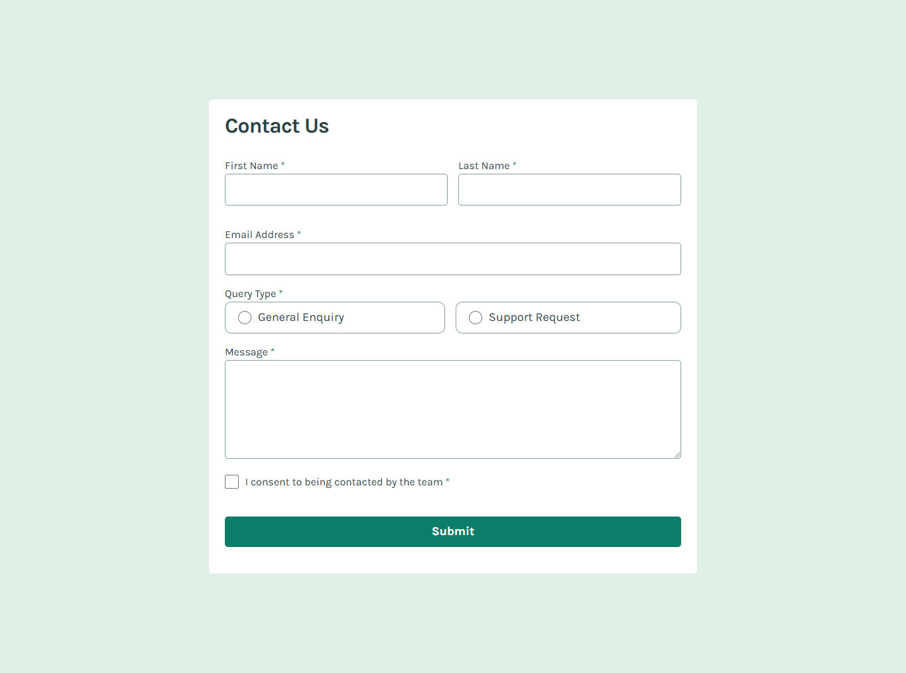

## Table of contents

- [Overview](#overview)
  - [The challenge](#the-challenge)
  - [Screenshot](#screenshot)
  - [Links](#links)
- [My process](#my-process)
  - [Built with](#built-with)
  - [What I learned](#what-i-learned)
  - [Continued development](#continued-development)
  - [Useful resources](#useful-resources)
- [Author](#author)
- [Acknowledgments](#acknowledgments)

**Note: Delete this note and update the table of contents based on what sections you keep.**

## Overview

### The challenge

Users should be able to:

- Complete the form and see a success toast message upon successful submission
- Receive form validation messages if:
  - A required field has been missed
  - The email address is not formatted correctly
- Complete the form only using their keyboard
- Have inputs, error messages, and the success message announced on their screen reader
- View the optimal layout for the interface depending on their device's screen size
- See hover and focus states for all interactive elements on the page

### Screenshot



### Links

- Solution URL: [Add solution URL here](https://your-solution-url.com)
- Live Site URL: [Add live site URL here](https://your-live-site-url.com)

## My process

### Built with

- Semantic HTML5 markup
- CSS custom properties
- Flexbox
- Mobile-first workflow

### What I learned

## The closest() method

is used to find the nearest ancestor (including the element itself) that matches a specified selector. It starts from the element itself and works its way up the DOM tree to its parent elements. If no match is found, it returns null. This is useful for traversing the DOM to find related elements, such as getting the nearest .form-group or any other parent container.

Key Points:

- Starts with the element itself.

- Checks its ancestors (parents, grandparents, etc.).
- If no ancestor matches the selector, it returns null.
  Commonly used in forms or when you need to target an element's parent.

```js
const checkbox = document.querySelector('input[type="checkbox"]');

const formGroup = checkbox.closest('.form-group');
};
```

##

## Grouping Input Elements and Validating Using the type Property

Instead of individually targeting each input element, I grouped them together using querySelectorAll and iterated through them using the `forEach()` method. By doing so, I can validate different input types based on their type property, allowing for cleaner and more efficient code.

```js
formInputs.forEach((input) => {
  if (input.type === "text") {
    // Validate text input
  }
  if (input.type === "email") {
    // Validate email input
  }
  if (input.type === "checkbox") {
    // Validate checkbox input
  }
});
```

## Key Points

- forEach(): Loops through each item in the NodeList returned by querySelectorAll().

- input.type: Allows you to check the type of the input (e.g., "text", "email", "checkbox").

- Flexible validation: With this approach, you can handle different types of inputs in one loop, applying different validation logic depending on the type.

### Continued development

Want to get better a form validations

## Author

- Frontend Mentor - [@Mikewil245](https://www.frontendmentor.io/profile/mikewil245)
